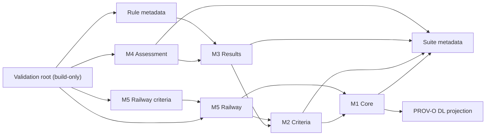

# Decisions

Every governed conceptual/implementation decision since the Gate B freeze, in one file. Replaces the former GATE_B_CHANGE_RECORD.md, CONCEPTUAL_CHANGE_POLICY.md, CONCEPTUAL_CHANGE_CATALOG.tsv, K_CONSTRAINT_IMPLEMENTATION.md, IMPORT_GRAPH.md and PROV_O_MAPPING.md — six files that referenced each other and had to be kept in sync by hand. Content below is unedited from those files (only concatenated with section headers), so nothing technical was rewritten or lost in this consolidation.

## Admission policy

The frozen Gate B catalogue remains the approved baseline. A term absent from that baseline cannot become accepted merely because it appears in code.

## Admission classes

- **Extension:** a new class that is a named specialisation of an already approved class, does not change a closed value set, and does not participate in a K-constraint or competency question. The catalogue must name its approved parent and change record.
- **Revision:** a new root/conceptual entity, a term that changes a closed value set, or any new term that participates in a K-constraint or competency question. Revision requires conceptual reapproval before release.

Properties and individuals that change the conceptual contract are registered too. The implementation audit verifies every registered term exists with the declared kind. It also rejects an `extension` entry without an approved named parent or with K/CQ participation.

`Payload` is a **revision**, not an extension: it is a new generic M1 entity rather than a specialisation below one of the frozen 76 classes. `undeterminedBoundary` is also a recorded revision of a closed value set under CR-B-009 even though individuals are not part of the class-count audit.

The 76-row matrix remains evidence for the frozen baseline only. The conceptual-change catalogue is reviewed beside it; neither document alone is presented as evidence of full conceptual equivalence.

## Conceptual change catalog

Machine-checked registry: every row must exist with its declared kind; an `extension` row without an approved named parent or with K/CQ participation is rejected.

| term | home_module | term_kind | change_kind | named_parent | participates_in_k_or_cq | change_record |
|---|---|---|---|---|---|---|
| Payload | M1 | class | revision | - | false | CR-B-008 |
| evaluationStageIdentifier | M2 | datatypeProperty | revision | - | true | CR-B-011 |
| stageCandidateTypeIri | M2 | datatypeProperty | revision | - | true | CR-B-011 |
| CriticalViolationType | M5 | class | revision | - | true | CR-B-013 |
| criticalAuthenticityViolation | M5 | individual | revision | CriticalViolationType | true | CR-B-013 |
| criticalIntegrityViolation | M5 | individual | revision | CriticalViolationType | true | CR-B-013 |
| assessesCriticalViolation | M5 | objectProperty | revision | - | true | CR-B-013 |
| elevatesTransmissionThreat | M5 | objectProperty | revision | - | true | CR-B-013 |
| assessesFailSafeCompromiseFrom | M5 | objectProperty | revision | - | true | CR-B-014 |
| SILRiskType | M5 | class | revision | - | true | CR-B-015 |
| maximumSILRisk | M5 | individual | revision | SILRiskType | true | CR-B-015 |
| assessesSILRisk | M5 | objectProperty | revision | - | true | CR-B-015 |
| AccessRiskType | M5 | class | revision | - | true | CR-B-016 |
| privilegedMaintenanceAccessRisk | M5 | individual | revision | AccessRiskType | true | CR-B-016 |
| privilegedSupplierAccessRisk | M5 | individual | revision | AccessRiskType | true | CR-B-016 |
| highRiskMaintenancePath | M5 | individual | revision | AccessRiskType | true | CR-B-016 |
| remoteAccessRisk | M5 | individual | revision | AccessRiskType | true | CR-B-016 |
| assessesAccessRisk | M5 | objectProperty | revision | - | true | CR-B-016 |
| assessesAccessMechanism | M5 | objectProperty | revision | - | true | CR-B-016 |
| iterationCount | M3 | datatypeProperty | revision | - | true | CR-B-019 |
| artefactDigest | M3 | datatypeProperty | revision | - | true | CR-B-019 |
| publishable | M3 | datatypeProperty | revision | - | true | CR-B-019 |
| refusalReason | M3 | datatypeProperty | revision | - | true | CR-B-019 |
| VulnerableFlow | M5 | class | revision | RailwayInformationFlow | true | CR-B-023 |
| DoSExposedFlow | M5 | class | revision | VulnerableFlow | true | CR-B-023 |
| UnauditedFlow | M5 | class | revision | VulnerableFlow | true | CR-B-023 |
| UnsegmentedCrossBoundaryFlow | M5 | class | revision | VulnerableFlow | true | CR-B-023 |
| ControlWeaknessType | M5 | class | revision | - | true | CR-B-023 |
| missingMessageAuthentication | M5 | individual | revision | ControlWeaknessType | true | CR-B-023 |
| missingIntegrityProtection | M5 | individual | revision | ControlWeaknessType | true | CR-B-023 |
| missingRateLimiting | M5 | individual | revision | ControlWeaknessType | true | CR-B-023 |
| missingMonitoring | M5 | individual | revision | ControlWeaknessType | true | CR-B-023 |
| missingSegmentation | M5 | individual | revision | ControlWeaknessType | true | CR-B-023 |
| assessesControlWeakness | M5 | objectProperty | revision | - | true | CR-B-023 |
| weaknessFlowType | M5 | objectProperty | revision | - | true | CR-B-023 |
| rateLimitingEnabled | M5 | datatypeProperty | revision | - | true | CR-B-023 |
| monitoringEnabled | M5 | datatypeProperty | revision | - | true | CR-B-023 |
| networkSegmentationEnabled | M5 | datatypeProperty | revision | - | true | CR-B-023 |
| crossesTrustBoundary | M5 | datatypeProperty | revision | - | true | CR-B-023 |
| wirelessMedium | M5 | datatypeProperty | revision | - | true | CR-B-023 |

## Change record (CR-B-001 to CR-B-023)

The Gate B conceptual package is frozen. This register records every issue discovered during formalisation, including clarifications that do not change the architecture. No implementation file may silently override the conceptual package.

## Record schema

Each entry states the trigger, affected frozen item, decision, rationale, implementation consequence and whether conceptual reapproval is required.

## CR-B-001 — OrderingResult multiple inheritance

- **Status:** clarification accepted; no conceptual change.
- **Trigger:** `OrderingResult` appears under both `DerivedResult` and `VersionedArtefact` in the specialisation table.
- **Affected items:** ORF-23, K-07, hierarchy rows 145 and 148.
- **Decision:** retain both superclass axioms. `OrderingResult` is a result produced in a Run and is also an independently versioned result because ORF-23 explicitly requires the ordering result to carry its version and method context. K-07 therefore applies.
- **Implementation consequence:** encode `OrderingResult rdfs:subClassOf DerivedResult, VersionedArtefact`. Merge the two VersionedArtefact rows editorially in generated documentation; do not remove either axiom.
- **Reapproval required:** no.

## CR-B-002 / D-B11 — Incomplete boundary information

- **Status:** superseded by CR-B-009 during Phase 2 before release.
- **Trigger:** `BoundaryStatusValue` has no `undetermined` value.
- **Affected items:** ORF-05, K-01, D-B6, assertion epistemic model.
- **Decision:** do not add `undetermined` to `BoundaryStatusValue`. The boundary status is an input declaration, not a derived criterion outcome. Under ORF-05 and K-01, every Element in a release-valid InstanceSet must have exactly one of `in-scope`, `out-of-scope` or `external`. If the status is not known, the fixture is incomplete and fails K-01; unknown remains the absence of an applicable assertion, not a fourth status value.
- **Implementation consequence:** SHACL reports a missing BoundaryStatusAssertion. Draft/incomplete datasets may be inspected but cannot be labelled release-valid. ETCS fixture preparation must record unresolved source information separately and cannot mask it as a valid boundary value.
- **Reapproval required:** no, because this preserves the frozen requirements and D-B6 rather than changing them.

## CR-B-003 — Split VersionedArtefact table row

- **Status:** editorial clarification; no conceptual change.
- **Trigger:** the VersionedArtefact specialisations occupy two consecutive table rows.
- **Affected items:** hierarchy rows 147–148.
- **Decision:** treat both rows as one set of specialisations. The split has no semantic meaning.
- **Implementation consequence:** generated documentation may render one merged row; the frozen source document is not edited.
- **Reapproval required:** no.

## CR-B-004 — Generic assertion object under OWL 2 DL

- **Status:** encoding selected; conceptual model unchanged.
- **Trigger:** the conceptual `assertion object` may be either an individually referable resource or a literal. OWL 2 DL does not permit one IRI to act as both an object property and a datatype property.
- **Affected items:** assertion proposition pattern, ORF-09, ORF-35, D-B7.
- **Decision:** keep the three generic proposition relations as one query contract but split them at the OWL syntax boundary: `assertionSubject` is an object property; the represented predicate is recorded by `assertionPredicateIri` as `xsd:anyURI`; and the conceptual object is represented by mutually exclusive `assertionObjectResource` or `assertionObjectLiteral`. Specialised assertion subclasses retain their typed properties.
- **Implementation consequence:** SHACL must enforce exactly one object branch where the generic proposition pattern is used. CQ-29 queries the resource and literal branches with `UNION`. No IRI is punned as both an object and datatype property, and the ontology remains in the intended OWL 2 DL profile.
- **Reapproval required:** no; this is the syntactic split explicitly anticipated by the frozen assertion-pattern note.

## CR-B-005 — Criterion-to-category reference

- **Status:** OWL 2 DL encoding selected for implementation test; conceptual model unchanged.
- **Trigger:** `Criterion` is an individually referable record, while the object of `determines membership of` is an OWL class such as `CandidateExaminationTarget`.
- **Affected items:** ORF-12, ORF-26, D-B1, `AssessmentBearingCategory` hierarchy.
- **Decision:** use standard OWL 2 punning for assessment-bearing category IRIs. A category IRI is interpreted as a class in classification axioms and as a named individual when it is the value of criterion metadata. These interpretations remain semantically separate under OWL 2 DL.
- **Implementation consequence:** `CandidateExaminationTarget` and `EntryPoint` are declared as classes and named individuals of `AssessmentBearingCategory`; `determinesMembershipOf` remains an object property. EV-B1 and the CQ-09/CQ-10 tests must demonstrate that the metadata link and the class entailment agree through K-23 rather than assuming that punning itself creates that agreement.
- **Reapproval required:** no unless testing shows that this representation prevents the required agreement or queries.

## CR-B-006 — PROV-O OWL 2 DL dependency projection

- **Status:** encoding correction accepted; conceptual mapping unchanged.
- **Trigger:** the initial pin used the aggregate `https://www.w3.org/ns/prov.ttl`, and the canonical `prov-o.ttl` itself uses `prov:specializationOf` and `prov:wasRevisionOf` as both annotation and object properties. OWLAPI therefore rejects the unmodified document from OWL 2 DL.
- **Affected items:** D-B8a, D-B8b, Step 0 validation harness.
- **Decision:** retain the canonical import IRI `http://www.w3.org/ns/prov-o`; pin the unmodified canonical source for evidence; resolve the import locally to a reviewed OWL 2 DL-safe projection containing only the PROV-O terms used by M1–M3.
- **Implementation consequence:** `imports/prov-o-source.ttl` is evidence, `imports/prov-o-dl.ttl` is the executable dependency, and the catalogue maps the canonical IRI to the projection. OWLAPI profile validation and HermiT reasoning run over that closure.
- **Reapproval required:** no; project mappings remain the subclass/subproperty mappings already approved by D-B8b.

## CR-B-007 — Explicit non-replacement marker

- **Status:** encoding completion; conceptual constraint unchanged.
- **Trigger:** K-21 permits a deprecation to record either a replacement or an explicit non-replacement, but the frozen relation/attribute catalogue provided only `replacedBy`.
- **Affected items:** ORF-47, K-21.
- **Decision:** add the boolean datatype property `explicitNonReplacement` on `Deprecation` solely to encode the already-approved second K-21 branch.
- **Implementation consequence:** SHACL uses `sh:xone` between one-or-more `replacedBy` values and `explicitNonReplacement true`.
- **Reapproval required:** no unless the added marker is rejected as an implementation attribute.

## CR-B-008 — Payload revision and EN 50159 input/conclusion separation

- **Status:** Phase 2 model decision accepted for implementation.
- **Trigger:** the railway rules need to distinguish facts carried by the architecture from conclusions produced by criteria. The frozen M1 catalogue also has no generic payload term.
- **Affected items:** M1 extension boundary, M5 transmission categories, D-B9, Step 9 and Step 12.
- **Decision:** add the generic `Payload`/`carriesPayload` vocabulary to M1 and register `Payload` as a Gate B **revision** in `CONCEPTUAL_CHANGE_CATALOG.tsv`. It is not an extension because it introduces a new generic entity rather than specialising a frozen one. M5 specialises payloads and declares category-input assertion types. Environment control and participant-set fixedness are `AssertedFact` records. Exclusion of unauthorised access is an attributed `Assumption`. `Category1Transmission`, `Category2Transmission` and `Category3Transmission` are assessment-bearing classes reached only through a satisfied `CriterionEvaluation`.
- **Rejected alternative:** assert the EN 50159 category directly on a flow, or encode `closed`/`partly-open`/`open` as synonyms for categories 1/2/3. Rejected because Category 2 and Category 3 may both use open transmission systems and differ by the access-exclusion judgement; direct assertion would also remove the criterion and provenance chain required by D-B9.
- **Rejected alternative:** encode safeguard-to-threat implications as M5 class axioms. Rejected because a statement such as missing integrity protection implying corruption exposure is a sourced criterion, not terminology. M5 may carry documentation-only annotation links; executable implications belong to Step 12 rules.
- **Implementation consequence:** the frozen 76-row matrix remains frozen-baseline evidence only. The formalisation audit checks the exact union of frozen classes and governed class changes and verifies every registered property/class declaration. Category rules first construct three-valued evaluations and only then entail membership from `satisfied`.
- **Reapproval required:** yes for the conceptual Phase 2 package before public release; implementation and testing may proceed on this recorded decision.

## CR-B-009 — Explicit undetermined boundary status and honest coverage

- **Status:** Phase 2 model decision accepted; supersedes CR-B-002.
- **Trigger:** absence of a boundary assertion made a draft dataset invalid but could not represent an explicitly reviewed-yet-unresolved element. Coverage could then silently exclude such elements from its denominator.
- **Affected items:** ORF-05, K-01, `BoundaryStatusValue`, boundary coverage.
- **Decision:** add `undeterminedBoundary` as the fourth closed boundary-status value. It counts as the one explicit K-01 status, but not as a determined assessment.
- **Rejected alternative:** continue representing unknown as a missing assertion. Rejected because missing data and an explicit unresolved judgement are different states, and because coverage over assessed-only elements systematically overstates completeness.
- **Implementation consequence:** boundary coverage reports total, determined and undetermined element counts and calculates `determined / total`. `undeterminedBoundary` remains in the denominator. Publication policy may later set an allowed threshold, but cannot hide the count.
- **Reapproval required:** yes before public release because the frozen value set changes.

## CR-B-010 — Bounded reasoner/rule fixed point

- **Status:** orchestration decision accepted for Step 13.
- **Trigger:** SPARQL CONSTRUCT rules and OWL entailments can enable one another.
- **Affected items:** Run orchestration, derivation evidence and performance diagnostics.
- **Decision:** the orchestrator owns the complete Run and iterates the reasoner/rule pair until no new triples are produced. It records the actual round count, warns above three rounds and fails without publication at a hard limit of ten rounds.
- **Rejected alternative:** execute reasoner and rules once, or iterate without a limit. The first can miss dependent conclusions; the second can conceal modelling cycles and create unbounded execution.
- **Implementation consequence:** Step 13 must compare triple-set deltas, permit only monotonic CONSTRUCT rules in this loop and retain iteration diagnostics in the Run record.
- **Reapproval required:** no; this operationalises the already separated reasoning layers.

## CR-B-011 — Generic evaluation-stage coverage and downstream unknown propagation

- **Status:** Phase 2 model decision accepted for implementation.
- **Trigger:** a flow with undetermined transmission category receives no category membership. A downstream threat stage restricted to entailed Category 2/3 membership would silently omit it and overstate threat-analysis completeness.
- **Affected items:** Criterion metadata, coverage queries, Step 12 dependency contract and CQ/K governance.
- **Decision:** criteria declare `evaluationStageIdentifier` and `stageCandidateTypeIri`. One generic query calculates, for each Run and stage, the total candidate universe, candidates with every expected evaluation present and non-undetermined, candidates without a determined stage result, and their ratio. Both properties are Gate B revisions because they participate in an integrity/coverage query.
- **Decision:** downstream threat rules consume the upstream category `CriterionEvaluation` outcomes, not only entailed category class membership. An upstream `undetermined` therefore produces downstream `undetermined`; it cannot disappear from the candidate universe.
- **Rejected alternative:** add a bespoke completeness counter per threat or use only class membership as the input filter. The first duplicates semantics; the second makes unknown upstream results invisible.
- **Implementation consequence:** `evaluation-stage-coverage.rq` is reusable for the category stage and all later threat stages. A Run has at most one evaluation per element/criterion pair. The category fixture includes both a partially known flow and a no-input flow whose three category evaluations are all `undetermined`.
- **Reapproval required:** yes before public release because M2 gains new query-bearing criterion metadata.

## CR-B-012 — Threat exposure is an evaluation, not flow typing

- **Status:** Phase 2 model decision accepted for provisional implementation.
- **Trigger:** a transmission can be exposed to several EN 50159 threats at once, while the seven threat kinds are distinct vocabulary classes. Directly typing one flow as several disjoint threat classes would make the ontology inconsistent and would discard the three-valued outcome required downstream.
- **Decision:** each threat criterion produces a `CriterionEvaluation` with `satisfied`, `notSatisfied` or `undetermined`. The criterion identifies the assessed threat through `assessesTransmissionThreat`. Category 2/3 applicability is consumed from upstream category evaluations belonging to the same Run.
- **Rejected alternative:** assert legacy `*Vulnerability` classes directly on flows or infer threat exposure from M5 safeguard annotations. The first conflicts with the threat taxonomy and hides unknowns; the second turns documentation links into unsourced executable criteria.
- **Implementation consequence:** Step 12.2 produces seven evaluations per railway flow and no direct threat membership. Legacy R2.2 mappings remain a provisional `JudgementBasis` until reviewed standard `SourceLocation` and `Interpretation` records are supplied.
- **Reapproval required:** yes before public release because the provisional mappings are not normative evidence.

## CR-B-013 — Safety-critical elevation vocabulary (Step 12.3)

- **Change:** M5 gains `CriticalViolationType`, a closed set containing `criticalAuthenticityViolation` and `criticalIntegrityViolation`, plus the functional Criterion properties `assessesCriticalViolation` and `elevatesTransmissionThreat`.
- **Admission class:** revision, not extension. The type is a new conceptual entity rather than a specialisation below one of the frozen 76 classes, and all five terms participate in criteria and therefore in evaluation results. Conceptual reapproval is required before release.
- **Rationale:** the provisional interpretation gives masquerade and corruption the highest priority for safety-related communication. Elevation is a criterion outcome, mirroring the transmission-threat stage; no flow is typed directly with a violation class, preserving ORF-12 and ORF-13.
- **Rejected alternative:** copy all four legacy Block 2.3 rules by inventing emergency-command and position-status payload classes. Only R2.3.1 and R2.3.2, expressible using the approved `SafetyRelatedPayload` / `NonSafetyPayload` distinction, are implemented. R2.3.3 delay elevation on emergency-command payload and R2.3.4 resequencing elevation on position-status payload remain deferred until a separate payload-vocabulary revision is approved.
- **Provenance status:** the two criteria rest on a provisional `JudgementBasis`. Exact EN 50159 edition, source location and reviewed interpretation are required before release, as for the category and threat stages.
- **Reapproval required:** yes before public release.

## CR-B-014 — Fail-safe compromise is an asset evaluation (Step 12.4)

- **Change:** M5 gains the functional Criterion property `assessesFailSafeCompromiseFrom`, linking a fail-safe criterion to the critical-violation type it consumes.
- **Decision:** fail-safe compromise is represented by a three-valued `CriterionEvaluation` concerning a `SafetyCriticalAsset`. It requires an upstream critical-violation evaluation for a flow terminating at that asset and an explicit architecture chain in which the asset realises a safety function whose fail-safe behaviour depends on the asset.
- **Rejected alternative:** infer or assert the legacy `FailSafeVulnerability` class directly on the asset. Direct typing would hide unknown dependencies and upstream `undetermined` outcomes and would bypass the provenance chain.
- **Scope limitation:** legacy R2.4.1 and R2.4.2 are implemented provisionally. R2.4.3 is deferred because `MobileOperationalZone` and a governed remediation-priority result are absent from the approved vocabulary; neither is invented in this step.
- **Provenance status:** the criteria rest on a provisional `JudgementBasis`. The legacy clause claims are implementation history, not normative evidence; reviewed source locations and interpretations remain release requirements.
- **Reapproval required:** yes before public release.

## CR-B-015 — SIL risk vocabulary (Step 12.5)

**Change.** M5 gains `SILRiskType` (closed set containing `maximumSILRisk`) and
the functional object property `assessesSILRisk` on `Criterion`.

**Admission class.** Revision. `SILRiskType` is a new conceptual entity rather
than a specialisation below one of the frozen 76 classes, and both terms
participate in criteria and therefore in evaluation results.

**Rationale.** Legacy v3 R2.5.3 states that a fail-safe compromise on a
safety-critical asset is the worst case, consumed downstream as the maximum-risk
override. It is modelled as a criterion outcome aggregating the fail-safe stage:
any satisfied compromise is sufficient, an undetermined compromise propagates,
and only a wholly negative input set concludes notSatisfied. No asset is typed
with a risk class, so ORF-12 and ORF-13 remain structurally enforced.

**Not implemented, with reasons.** Legacy v3 R2.5.1 and R2.5.2 classify attacks
on safety-critical and safety-related assets as SIL-critical and SIL-relevant.
Both require an attack technique vocabulary, which the approved model does not
contain and which would be a further conceptual revision. They are deferred
rather than approximated.

**Criterion decision deferred.** The legacy rationale equates a safety-critical
asset with SIL 4. The implemented criterion uses safety-critical class
membership only and does not consult `hasSafetyIntegrityLevel`, so an asset
without a recorded SIL is not treated as unknown at this stage. Requiring an
explicit SIL-4 assignment, and returning undetermined where none is recorded, is
a defensible alternative and is recorded here for decision rather than chosen
silently.

**Provenance status.** The criterion rests on a recorded provisional
`JudgementBasis`. Reviewed IEC 61508 and EN 50126 source locations and
interpretations are still required before release.

**Closed-set note.** `SILRiskType` currently contains one individual. Adding the
deferred SIL attack types later changes a closed value set and is therefore a
versioned change under D-B6, not an extension.

## CR-B-016 — access risk vocabulary (Step 12.6)

**Change.** M5 gains `AccessRiskType` (closed set of four individuals:
`privilegedMaintenanceAccessRisk`, `privilegedSupplierAccessRisk`,
`highRiskMaintenancePath`, `remoteAccessRisk`) and two functional object
properties on `Criterion`: `assessesAccessRisk` and `assessesAccessMechanism`.

**Admission class.** Revision. `AccessRiskType` is a new conceptual entity and
all terms participate in criteria and therefore in evaluation results.

**Subject change, recorded rather than silent.** Legacy v3 R2.6.1 attributes
privileged access risk to the maintenance *actor*. Actors and roles are not in
the approved model and are listed as unmapped in the ETCS case. The criterion is
therefore re-subjected onto the safety-critical asset that the mechanism
reaches. This preserves the scoping intent, since the artefact scopes elements
rather than people, but it is a change of subject and not a translation. If an
actor and role vocabulary is later admitted, the criterion should be restated on
its original subject.

**Epistemic treatment of access.** An element with no `reachableBy` statement at
all is undetermined: an unstated access inventory is not evidence that no access
exists. An element with a stated inventory that does not contain the assessed
mechanism is notSatisfied. This distinction is the reason the stage needs three
values, and it is the point most likely to be lost in a later refactoring.

**Provenance status.** All four criteria rest on a recorded provisional
`JudgementBasis`. Reviewed TS 50701 source locations and interpretations are
still required before release.

## CR-B-017 — classification provenance and K-25 (Step 12.7)

**Change.** `prov:wasDerivedFrom` added to the PROV-O DL import.
`rss-crit:JudgementBasis` becomes a subclass of `prov:Entity` so that it can be
the object of that property. A new constraint **K-25** in `shapes/railway.ttl`
requires every `SafetyCriticalAsset` to carry exactly one reified classification
assumption.

**Admission class.** Revision for the JudgementBasis superclass; the import
addition is a vocabulary completion, since the property was already implied by
the intended provenance pattern.

**Why the classification is an Assumption and not an AssertedFact.** The source
workbook column `Assets_Flat.AssetClass`, imported under the rule recorded in
`mapping.csv`, evidences that the value `SafetyCritical` was transferred. It does
not evidence that the asset is safety-critical. Under EN 50126 and EN 50129 that
determination follows from hazard analysis and tolerable hazard rate
apportionment, recorded in a safety case, which was not available. No safety
integrity level is recorded for any of the nine assets. Every classification is
therefore an assumption with an explicit judgement basis.

**Two provenance roles kept apart.** `Ontology_model.xlsx` and `mapping.csv` are
data-transfer provenance: they record how a value reached the case file.
`case:safety-critical-classification-basis` is a judgement record: it states why
the transferred value is provisionally retained without safety-case evidence.
Merging them would let a spreadsheet stand as evidence for a safety
determination.

**Architecture source not cited for classification.** Four assets carry a
separate identity assumption derived from `case:asset-identity-basis`, covering
existence and naming only. The architecture description is not cited by any
classification assertion, because it does not make that claim. A test asserts
that the identity basis is never the derivation source of a classification.

**Interpretation confidence deliberately not used.** `interpretationConfidence`
has `Interpretation` as its domain, so applying it to a `JudgementBasis` would be
a domain violation. Judgement records carry `reasoning`, `revisionConditions`
and the assumption epistemic status only. A machine-readable confidence scale
for judgements, if wanted, is a separate controlled vocabulary revision.

**K-25 is general to M6, not ETCS-specific.** Consequently the five synthetic
safety-critical assets in the fixtures also carry classification assumptions,
derived from a fixture-only judgement basis that records their synthetic origin
and is explicitly barred from reuse in case data.

## CR-B-018 — documentation integrity guards and stableIdentifier domain

**Change.** `rsso:stableIdentifier` gains `rdfs:domain rss-core:Element`. Four
documentation corrections are applied, and `tests/test_documentation_integrity.py`
converts three previously untested prose claims into enforced invariants.

**stableIdentifier domain.** The property had a range but no domain, which
contradicted the Step 1 claim that every own property carries both. In the case
data it is carried only by `Element` and its subclasses, so `Element` is the
correct and non-widening domain.

**Corrections.**

1. `STATUS.md` Step 1 stated fixed counts of object and datatype
   properties. Those counts were accurate at the freeze and have since grown
   through admitted revisions, so the sentence had become false as written. It
   now states the frozen class baseline explicitly and defers the property claim
   to an enforced invariant instead of a number.
2. `CODE_AND_FILES_GUIDE_UA.md` referenced the former CQ-09-candidates query,
   deleted when the duplicate CQ-09 was unified. Note that the filename is
   deliberately written without backticks here: the new guard treats a quoted
   repository path as a claim that the file exists.
3. `LEGACY_ARCHITECTURE_SOURCES.md` now records that **v3 numbering is canonical**,
   with the block correspondence to v6, because the two versions assign the same
   identifiers to different rules. `migration/legacy-rule-triage.csv` and its 54
   rules settle the question.
4. No change to the 54/54 legacy rule claim: it is correct as measured.

**New guards, each mutation-checked.**

- every own object and datatype property has a domain and a range;
- every M1–M4 class appears either in the frozen entity matrix or in the
  conceptual change catalog, which is the drift that let `Payload` enter the
  ontology unseen by the matrix generator;
- every repository path cited in a document exists.

**Principle.** A number written in prose is only as reliable as the test that
fails when it stops being true. Where a claim could be enforced, the count was
replaced by the invariant rather than corrected to a new number that would go
stale at the next admitted revision.

## CR-B-019 — Run orchestrator and run-scoped results (Step 13)

**Change.** `scripts/orchestrator.py` executes one Run as a single controlled
analysis. Four datatype properties are added to `Run`: `iterationCount`,
`artefactDigest`, `publishable` and `refusalReason`. All seven stage rules now
mint run-scoped result identifiers.

**Admission class.** Revision for the four Run properties.

**Two defects the orchestrator exposed.** Both were invisible to the stage tests
because each of those loads exactly one Run.

1. *Result identifiers were not run-scoped.* Evaluation IRIs were built from the
   element and the criterion alone. With two Runs present both write to the same
   identifier, outcomes collide, and derivation records cite evaluations
   belonging to the other Run. ORF-45 requires version identity on results and
   ORF-46 requires two Runs to be comparable; neither can hold under colliding
   identifiers. Every stage rule now appends a digest of the Run IRI.
2. *Asymmetric instance-set joins.* Only the transmission-category stage joins on
   `usedInstanceSet`. A Run declaring no instance set therefore produced no
   category evaluations while still producing threat evaluations, leaving 70
   derivations citing upstream results that were never created. The orchestrator
   now refuses a Run that consumes no instance set, before deriving anything.

**Refusal rather than partial success.** Non-convergence within the iteration
bound is a refusal, not a recorded number. An absent description-logic reasoner
is a refusal, not a silent omission. A Run either satisfies every check and is
publishable, or it is refused with the reasons recorded on the Run itself.

**L3 hook placed inside the loop.** Entry-point classification consumes
reachability facts, so an external-computation call placed after convergence
would leave those criteria permanently undetermined. Coverage and ordering
consume final results and feed nothing back, so they belong after the loop.

**Determinism is now evidenced.** Two Runs over identical inputs derive
byte-identical graphs once the Run identity is masked. The conditional
reproducibility claimed in the rationale document previously had no test behind
it.

**Test coupling removed.** Three stage tests hard-coded evaluation IRIs and broke
under run scoping. They now locate evaluations by the element and criterion they
concern, so they test behaviour rather than identifier construction.

## CR-B-017 and CR-B-018 corrections found by continuous integration

Two changes I made were rejected by the pipeline and are corrected here. Both
are recorded rather than quietly amended, because each was a real defect in the
change rather than a tooling inconvenience.

**`stableIdentifier` domain reverted.** CR-B-018 added
`rdfs:domain rss-core:Element` to `rsso:stableIdentifier`. The metadata module
does not import the domain modules, so this named an undeclared class and took
the ontology **out of the OWL 2 DL profile**. Module independence is the more
important property: the metadata module must remain loadable without the domain
modules. The property is therefore recorded as deliberately domainless, with the
reason, in the invariant test rather than left as an unexplained exception.

**Two catalogue rows removed.** CR-B-017 recorded the `JudgementBasis`
subclass axiom and the imported `prov:wasDerivedFrom` property as rows in the
conceptual change catalogue. Neither is a new term in a governed module: the
first is an axiom on a term that is already governed, the second belongs to an
imported external vocabulary. The catalogue rejects both, correctly. They remain
recorded in CR-B-017 above, which is the right place for them.

**Two generated reports regenerated.** The inferred class hierarchy changed
because `JudgementBasis` now has `prov:Entity` as a named superclass, and the
entity formalisation matrix changed for `Element`, `JudgementBasis` and `Run`.
Both are committed deliberately, which is the behaviour the regression check is
designed to force.

## CR-B-020 — legacy security fact migration (Step 14)

**Change.** `scripts/migrate_legacy_security_facts.py` transfers the protection
and payload facts of the legacy assessment model into
`cases/etcs/security-facts.ttl`. `scripts/validate.ps1` now profile-checks the
case files added since `abox.ttl`, which it previously skipped.

**What was transferred.** All 88 legacy information flows matched a stable
identifier in the case, with none skipped, so no heuristic matching was needed.
616 protection facts were transferred across seven properties. Every one is an
`Assumption` attributed to a judgement basis recording that the legacy model
evidences the transfer, not the determination.

**What was deliberately not transferred, and why.**

*Transmission environment.* The legacy model recorded the medium, not whether the
transmission environment is under the operator's control. Deriving the second
from the first is a new determination, and the model requires it to be an
`EnvironmentControlFact` carrying asserted-fact status, that is, presented as
established. Asserting as established something the migration inferred would
defeat the purpose of the epistemic distinction. The environment is therefore
left unstated and the transmission-category criteria return undetermined.
Resolving it needs the network design, not the legacy model.

*Payload classification for 52 of 57 data links.* Payload is transferred only
where the legacy rule set itself relied on it: the legacy critical-violation
rules keyed on control command and position status data. The remaining legacy
data kinds were never used that way, and their absence from those rules is not
evidence that they are non-safety, so they are left unclassified.

**Blocker found: criteria are defined only in test fixtures.** Every criterion
used by the stages is declared inside `fixtures/railway-*/minimal.ttl`. The
rules require a `Criterion` to be present, so a run over the ETCS case with no
fixtures loaded produces zero evaluations even though the facts are now there.
Section 11 of the conceptual model allocates criteria to a module, M2 or M5
according to the vocabulary they use, not to case data and not to fixtures.
Moving them is a prerequisite for any case-study run and is a design decision:
whether the fixtures continue to declare their own criteria for isolation, or
consume the module ones.

## CR-B-021 — criteria moved into a module (Step 14b)

**Change.** `ontology/criteria-railway.ttl` holds the 19 railway assessment
criteria and their 6 judgement bases. The six phase-2 fixtures no longer declare
criteria and supply instance data only.

**Validation-closure correction.** Because this artefact is a reusable module,
not a fixture loaded only by Python, it has its own `owl:Ontology` header and M5
module metadata. The XML catalog resolves its ontology IRI locally, and the
build validation root imports it. This keeps the ROBOT/HermiT validation closure
aligned with the ontology files loaded by the Run orchestrator.

Importing the criterion individuals also exposed a previously latent datatype
defect: `criterionStatement`, `reasoning` and `revisionConditions` allowed only
`xsd:string`, while their authored values correctly carry language tags and are
therefore `rdf:langString`. Their ranges now admit the union of both datatypes;
the alternative of stripping language tags was rejected because these are
human-readable, potentially multilingual statements.

The two independently profile-checked ETCS provenance datasets now also carry
explicit `owl:Ontology` headers and the same assessment/railway vocabulary
imports as the main ETCS ABox. Previously they were anonymous RDF fragments, so
OWLAPI interpreted their otherwise declared object and datatype properties as
undeclared annotation properties when each file was validated in isolation.
The assessor remains a `prov:Agent`; the additional `prov:Person` type was
removed because that optional class is not part of the pinned PROV-O DL
projection and added no information used by the assessment model.

**Why.** Rules require a `Criterion` to be present in the loaded graph. While the
criteria lived in test fixtures, they applied in tests and nowhere else: a run
over the ETCS case produced zero evaluations even with the facts in place.
Section 11 of the conceptual model allocates criteria to a module according to
the vocabulary they use, not to case data and not to fixtures. Text and
provenance are unchanged; only the identifiers moved.

**Consequence for fixtures.** Fixtures now consume the module criteria rather
than declaring their own. A fixture-only judgement basis remains in the fail-safe
fixture, marked as confined to test data. One effect is visible in the tests: a
fixture graph read together with the module now shows every stage declared for
railway flows, not only the stage under test, so stage coverage is read per stage
rather than assumed to be the single row.

**Coverage of the legacy L2 block, corrected.** 19 of the 25 legacy railway rules
are implemented, not 25 as previously stated in conversation. The six not
implemented are R2.1.4, R2.3.3, R2.3.4, R2.4.3, R2.5.1 and R2.5.2. Five are
blocked on absent vocabulary — finer payload kinds, mobile zone and remediation
priority, attack techniques — each of which is a vocabulary revision rather than
rule work.

**First ETCS run.** With the migrated facts and the module criteria, the case
produces 888 transmission-category evaluations, all undetermined, each with a
derivation record. This is the correct outcome: the environment control,
participant set and unauthorised access facts are absent by design, because the
legacy model recorded the transmission medium rather than those three
conditions. The chain executes end to end and reports what it does not know.

**Performance measurement under ORN-02a.** On the 148 ETCS flows the
transmission-category stage takes about 1.7 seconds and the seven-threat stage
about 180 seconds, against seconds for both on the fixtures. The threat stage
evaluates seven criteria against every flow with nested optional patterns. This
is recorded as a measurement, not resolved; it must be optimised or moved to
external computation before the case study is run interactively.

## CR-B-022 — transmission environment derived for the ETCS case (Step 14c)

**Change.** `scripts/derive_transmission_environment.py` produces
`cases/etcs/transmission-environment.ttl`: the three conditions EN 50159 uses to
classify a transmission system, for the flows where the source model supports a
determination.

**Why this is a derivation and is recorded as one.** The source model records the
physical medium and an exposure rating, not the three conditions. The legacy
rules went from medium to category directly, inside the rule, so the step was
never inspectable. The rule the assessor applies is now stated once, recorded as
a judgement basis, and attached to every fact it produces:

| Condition | Rule applied |
|---|---|
| environment controlled | clearly wired medium, and exposure not high |
| participant set fixed | clearly wired medium |
| unauthorised access excluded | clearly wired medium, and exposure low |

**What is deliberately left unstated.** A flow whose medium is radio, mixed,
human or otherwise not clearly wired receives no fact, so its category stays
undetermined rather than being guessed. 52 interfaces of 88 were given facts and
36 were not.

**Interfaces and flows.** A workbook row describes an interface; the case
represents each interface as a forward and a reverse flow. The medium and
exposure apply to both directions, so each fact is attached to both. 267 facts
across 104 flows.

**Import declaration corrected.** The dataset first declared only the railway
module. `assertedInInstanceSet` belongs to the results module, reached through
assessment, so the OWL 2 DL profile check reported it as an undeclared
annotation property and continuous integration rejected the branch. The dataset
now imports assessment and railway, matching the other case datasets, and
carries a version IRI. This is the third time a change has been accepted by the
Python stack and rejected by the reasoner; a vocabulary or dataset change is not
verified until continuous integration has run it.

**First determined results for the ETCS case.** The transmission-category stage
now produces 178 satisfied, 356 not satisfied and 354 undetermined evaluations,
classifying 53 flows as Category 1 and 36 as Category 3, with 59 flows
undetermined. Every one carries a derivation record naming the criterion, the
facts used and the judgement basis behind them.

## CR-B-023 — L1 control weakness assessment (Step 15)

**Change.** M5 gains the vulnerable flow taxonomy, a closed set of five control
weakness types, two criterion properties and five flow properties. Two rules are
added, M5-R09 evaluating the controls and M5-R10 materialising the flow subtype.
Five criteria are added to the criteria module. The workbook transfer script now
also carries the three L1 control columns and the medium and boundary flags.

**Legacy coverage.** This implements legacy v3 block 1.1, rules R1.1.1 to
R1.1.5, the IEC 62443-3-3 control assessment. It is the first part of the L1
layer, which was not previously represented at all.

**Subtypes declared, not inferred.** DoSExposedFlow, UnauditedFlow and
UnsegmentedCrossBoundaryFlow are declared subclasses of VulnerableFlow in the
module rather than derived by a rule, because each is a kind of vulnerable flow
by definition. The legacy design records the same decision and the reason: a
subtype left to inference becomes invisible to later stages that consume
VulnerableFlow.

**Controls assessed independently.** The absence of any single control is a
finding, following the defence-in-depth principle stated in the legacy design.
An unstated control yields undetermined rather than a weakness, so a gap in the
record is never read as an absent control. Rate limiting and segmentation carry
a second condition, wireless medium and boundary crossing respectively; where
that condition is unstated the result is undetermined.

**Generated reports regenerated.** Adding five classes changed both the inferred
class hierarchy and the entity formalisation matrix, and continuous integration
rejected the branch until they were committed. The hierarchy gains
VulnerableFlow with its three subtypes and ControlWeaknessType; the matrix row
for Criterion changes because two new properties take it as their domain. This
is the regression check working as designed: a change to the vocabulary cannot
land without the derived reports being updated deliberately.

**First determined weaknesses in the ETCS case.** The stage produces 1480
evaluations: 258 satisfied, 630 not satisfied, 592 undetermined. It classifies
16 flows as denial-of-service exposed, 53 as unaudited and 60 as unsegmented
cross-boundary flows. These are the first confirmed findings in the case; the
EN 50159 stages had returned none, because the transferred protection facts
record those controls as present on almost every flow.

## K-constraint implementation map

| Constraint | Authority | Executable artefact |
|---|---|---|
| K-01–K-10 | SHACL Core/SPARQL; K-10 follows orchestrator capture | `shapes/constraints.ttl` |
| K-11 | SHACL Core | `shapes/criterion-slice.ttl` |
| K-12–K-18 | SHACL Core/SPARQL | `shapes/constraints.ttl` |
| K-19–K-20 | build-time module inspection | `scripts/publication_lint.py` |
| K-21 | SHACL Core | `shapes/constraints.ttl` |
| K-22 | automated guard plus mandatory manual review | `scripts/publication_lint.py`, `docs/PUBLICATION_REVIEW.md` |
| K-23 | post-L2 entailment/assignment agreement | `queries/K-23-assignment-agreement.rq` |
| K-24 | stage-authority query plus SHACL regression slice | `queries/K-24-layer-authority.rq`, `shapes/criterion-slice.ttl` |

The positive architecture fixture and the two negative fixture groups are executed by `tests/`. Structural validation deliberately runs before RDFS/OWL inference so that a property domain cannot silently turn an incorrectly typed position owner into a conforming record.

## Module import graph

**Decision ID:** IMPORT-B-001
**Status:** fixed for the 0.1.0 line

M2 and M3 use PROV-O through the transitive M1 import, while their project-specific mappings are declared in their home modules. The reusable railway-criteria ontology is an M5 reference-data module: it imports the M5 railway vocabulary and is imported by the build validation root. M6 case datasets contain individuals only; the validation orchestrator loads them with M5 and the validation root rather than making terminology modules import case data.

The graph is acyclic. `ontology/validation.ttl` is a build entry point, not a public terminology module, which avoids making the suite metadata import its own importers.

## PROV-O mapping (D-B8b)

**Status:** initial formal mapping for the 0.1.0 baseline.
**Authority:** D-B8a and the frozen Gate B conceptual package.

## Class mappings

| Project class | PROV-O class | Mapping | Rationale |
|---|---|---|---|
| `rss-core:Assertion` | `prov:Entity` | subclass | Assertions are identifiable inputs used by activities. |
| `rss-crit:VersionedArtefact` | `prov:Entity` | subclass | Versioned artefacts are entities used by Runs and steps. |
| `rss-crit:Criterion` | `prov:Entity` | inherited subclass | Criterion-specific semantics remain local. |
| `rss-crit:ExternalComputationMethod` | `prov:Plan` | subclass | The method is a plan followed by an external computation, not the executing activity. |
| `rss-res:DerivedResult` | `prov:Entity` | subclass | Results are generated entities. |
| `rss-res:UnresolvedInput` | `prov:Entity` | subclass | It is an identifiable record, not an assertion that the missing fact is false. |
| `rss-res:PerformanceMeasurement` | `prov:Entity` | subclass | A measurement is generated evidence about a Run. |
| `rss-res:Run` | `prov:Activity` | subclass | A Run is the encompassing execution activity. |
| `rss-res:DerivationStep` | `prov:Activity` | subclass | Each step uses and generates entities. |
| `rss-res:Mechanism` | `prov:SoftwareAgent` | subclass | The versioned mechanism bears responsibility for executing a step. |
| `rss-res:DerivationRecord` | `prov:Bundle` | subclass | The record is a named provenance bundle assembled across layers. |

Subclass mappings are used rather than equivalence because the project classes carry stronger domain-specific meaning and constraints.

## Property mappings

| Project property | PROV-O property | Mapping |
|---|---|---|
| `rss-res:producedByRun` | `prov:wasGeneratedBy` | subproperty |
| `rss-res:usedVersion` | `prov:used` | subproperty |
| `rss-res:usedInstanceSet` | `prov:used` | subproperty |
| `rss-res:usedEntity` | `prov:used` | subproperty |
| `rss-res:generatedResult` | `prov:generated` | subproperty |
| `rss-res:appliedCriterion` | `prov:used` | subproperty |
| `rss-res:executedByMechanism` | `prov:wasAssociatedWith` | subproperty |

M5 access-exclusion assumptions use the projected `prov:wasAttributedTo` property directly so the assessor responsible for the judgement is machine-readable. No local subproperty is introduced.

`rss-res:appliedComputation` is deliberately **not** a subproperty of `prov:hadPlan`: `prov:hadPlan` relates a qualified Association to a Plan, not an Activity directly to a Plan. If qualified associations are required in the derivation implementation, the orchestrator will emit a `prov:Association` with `prov:hadPlan`; the direct project property remains the domain query shortcut.

## Import policy

Production modules import the stable PROV-O ontology IRI `http://www.w3.org/ns/prov-o`. The build must resolve it to a locally pinned, checksum-recorded copy; tests must not depend on live network retrieval. No project class or property is declared equivalent to a PROV-O term in the 0.1.0 line.
