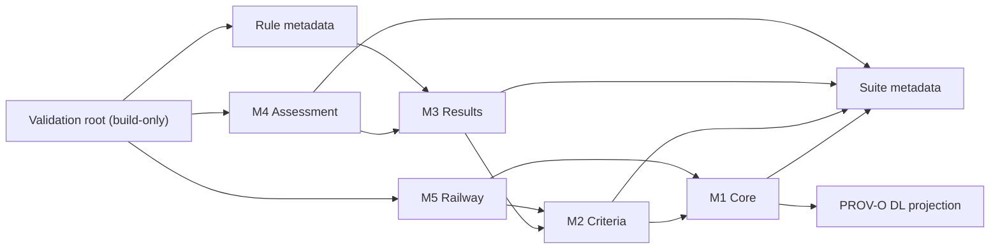

# Module import graph

**Decision ID:** IMPORT-B-001  
**Status:** fixed for the 0.1.0 line

M2 and M3 use PROV-O through the transitive M1 import, while their project-specific mappings are declared in their home modules. M6 case datasets contain individuals only; the validation orchestrator loads them with M5 and the validation root rather than making terminology modules import case data.

The graph is acyclic. `ontology/validation.ttl` is a build entry point, not a public terminology module, which avoids making the suite metadata import its own importers.
